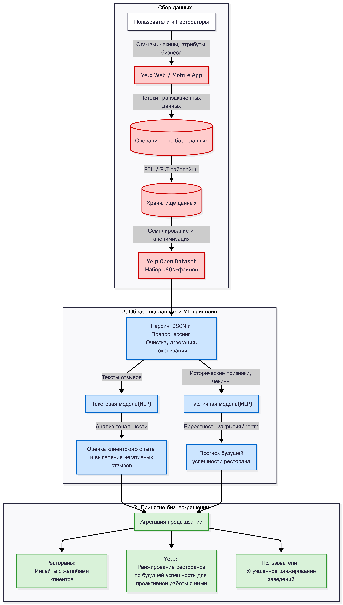

# Нейросетевая система оценки успешности ресторанов и анализа клиентского опыта на Yelp

## Описание проекта
Данный проект решает бизнес-задачу платформы Yelp: помощь ресторанам в улучшении качества сервиса и выявление ресторанов по будущей успешности для проактивной работы с ними

Проект состоит из двух задач машинного обучения
1. Прогноз успешности: MLP для бинарной классификации, модель предсказывает, будет ли ресторан успешным в будущем, на основе исторических данных, разделенных тайм сплитом
2. Анализ отзывов: NLP для классификации неструктурированных текстов отзывов на позитивный и негативный опыт

## Cхема, иллюстрирующая, как предлагаемое решение вписывается в бизнес-процессы компании

## Источники данных
В проекте используется Yelp Open Dataset https://www.kaggle.com/datasets/yelp-dataset/yelp-dataset/data

Этот набор данных представляет собой подмножество данных о компаниях, отзывах и пользователях Yelp. Первоначально он был создан для конкурса Yelp Dataset Challenge, который предоставляет студентам возможность проводить исследования или анализ данных Yelp и делиться своими открытиями. В самом последнем наборе данных вы найдете информацию о компаниях в 8 крупных городах США и Канады.
Этот набор данных содержит пять JSON-файлов и пользовательское соглашение.

(перевод описания с kaggle)

Мы использовали следующие JSONы
* `business.json` — метаданные о заведениях (город, категория, атрибуты, часы работы).
* `review.json` — полные тексты отзывов, оценки, дата публикации.
* `checkin.json` — история посещений заведений.

Данные отфильтрованы по категории Рестораны, и т.к. Москва отсутствует в датасете, выбрали наиболее похожий по рынку ресторанов среди доступных городов – Филадельфия

## Структура репозитория
Проект разделен на две основные директории в соответствии с решаемыми задачами

В папке [part_1](./part_1) лежат [part1_experiments.ipynb](./part1_experiments.ipynb), содержащий EDA, процесс генерации исторических признаков и обучение MLP-моделей, и артефакты

В папке [part_2](./part_2) лежат part2_biltsmcalssifier_ver1.ipynb, содержащий пайплайн работы с неструктурированными текстами от очистки и токенизации до обучения рекуррентной нейросети, и артефакты. Также лежит gp5p2_EDA и подготовка к TextСNN.ipynb, в котором проделан EDA, проведена токенизация и сохраняется файл для TextCNN. В файле gp5p2_Первичный запуск TextCNN.ipynb у нас лежит первая попытка запуска TextCNN, но она через CPU поэтому у нас есть файл part2_experiments_textcnn.ipynb, в котором финальная версия запуска TextCNN (через GPU).
